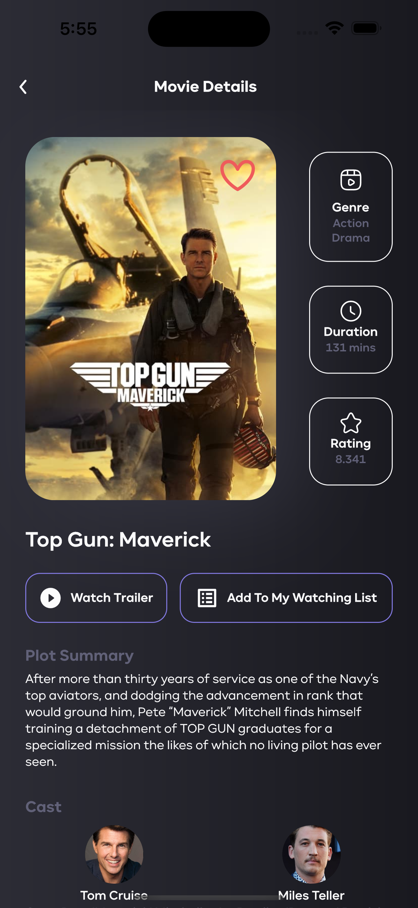
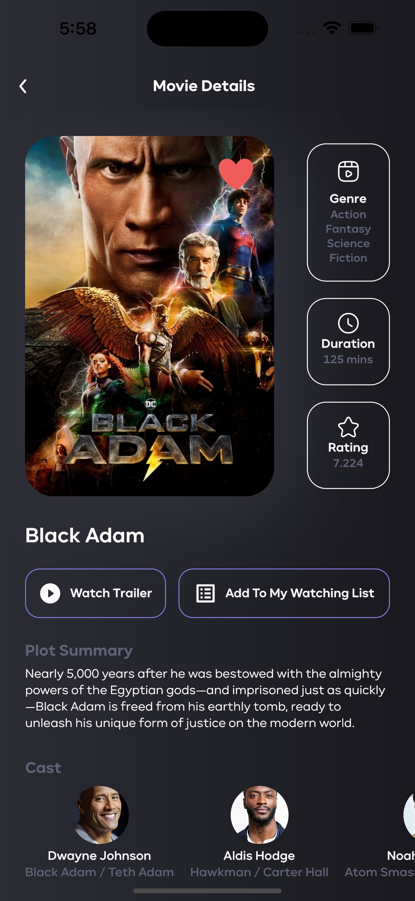

  
  
  
  <h3 align="center">Invitation Generator</h3>

  

    a flutter app to explore movies :purple_heart::fire:.
     
    <b>Contains</b>: see (treding, upcoming, now playing) movies, filter movies by genre, add/remove movies to/from favorite/watching list, besides search movies.
     
    <b>Uses</b>: Riverpod as a state management solution.
     
    <em>(Submited as a part of Okoul Challenge in)</em>
     
    <a href="https://twitter.com/ReemNawaf">Twitter</a>
    ·
    <a href="https://www.linkedin.com/in/reemnawaf/">LinkedIn</a>
  

## Table of contents
- [To Start](#to-start)
- [screenshots](#screenshots)
- [What Next?](#what-next)
- [Creator](#creators)

## To Start
This is a normal flutter app. You should follow the instructions in the [official documentation](https://flutter.io/docs/get-started/install).

## Screenshots

  

    
    
    
  

   
  

    
    
    
  

   
  

    
    
    
  

   
  

    
    
    
  

  

## What next?
* I might add a recommendation system to filter movies according to user preferences.

## Creators
<a href="https://github.com/ReemNawaf">*Reem Almutairi*</a>

Enjoy :purple_heart:☕:brain:
