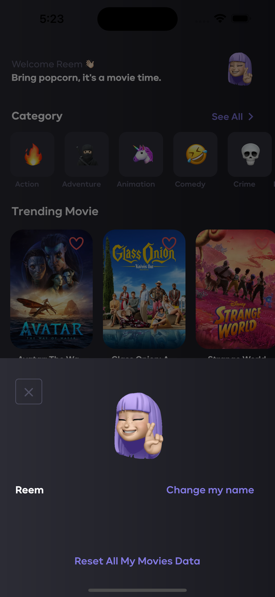
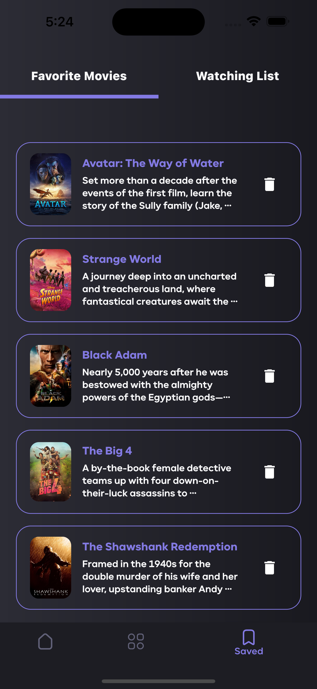

  
  
  
  <h3 align="center">Invitation Generator</h3>

  

    a flutter app to explore movies :purple_heart::fire:.
     
     
    <b>Contains</b>: see (treding, upcoming, now playing) movies, filter movies by genre,
     
    add/remove movies to/from favorite/watching list, besides search movies.
     
     
    <b>Uses</b>: Riverpod as a state management solution.
     
     
    <em>(Submited as a part of Okoul Challenge in)</em>
     
    <a href="https://twitter.com/ReemNawaf">Twitter</a>
    •
    <a href="https://www.linkedin.com/in/reemnawaf/">LinkedIn</a>
  

## Table of contents
- [App Demo](#app-demo)
- [Screenshots](#screenshots)
- [Used technologies](#used-technologies)
- [To Start](#to-start)
- [What Next?](#what-next)
- [Creator](#creators)

## App Demo

### App APK File
You can download the [App APK file](android/app-release.apk)

### Live Demo
You can use the app directally from [This Live Demo](https://amovie-a161c.web.app/#/)

### Recorded Demo
https://user-images.githubusercontent.com/32703659/210823920-bb7f6dc0-eb0f-4a8a-ae18-39136656cecc.mp4

## Screenshots
| Home Page | User Profile | User Profile | Movies Page By Genres |
| ----------- | ----------- | ----------- | ----------- |
|||||

| Animation Movies | Movie Details Page | Movie Trailer Page | Add Movie To Favorite List |
| ----------- | ----------- | ----------- | ----------- |
|||||

| Add Movie To Watching List | Favorite Movie List | Watching List | Actor Details Page |
| ----------- | ----------- | ----------- | ----------- |
| ||||

| Cast & Similar Movies Sections | Review Section | Search For Movies Page | Search For Movies Page |
| ----------- | ----------- | ----------- | ----------- |
||||

## Used Technologies
* Dart language
* Flutter Framework
* Riverpod for state managment
* Dio for Http calls
* Hive for local storage
* Shimmer Animation

## To Start
This is a normal flutter app. You should follow the instructions in the [official documentation](https://flutter.io/docs/get-started/install).

## What Next?
* I might add a recommendation system to filter movies according to user preferences.

## Creators
<a href="https://github.com/ReemNawaf">*Reem Almutairi*</a>

Enjoy :purple_heart:☕:brain:
